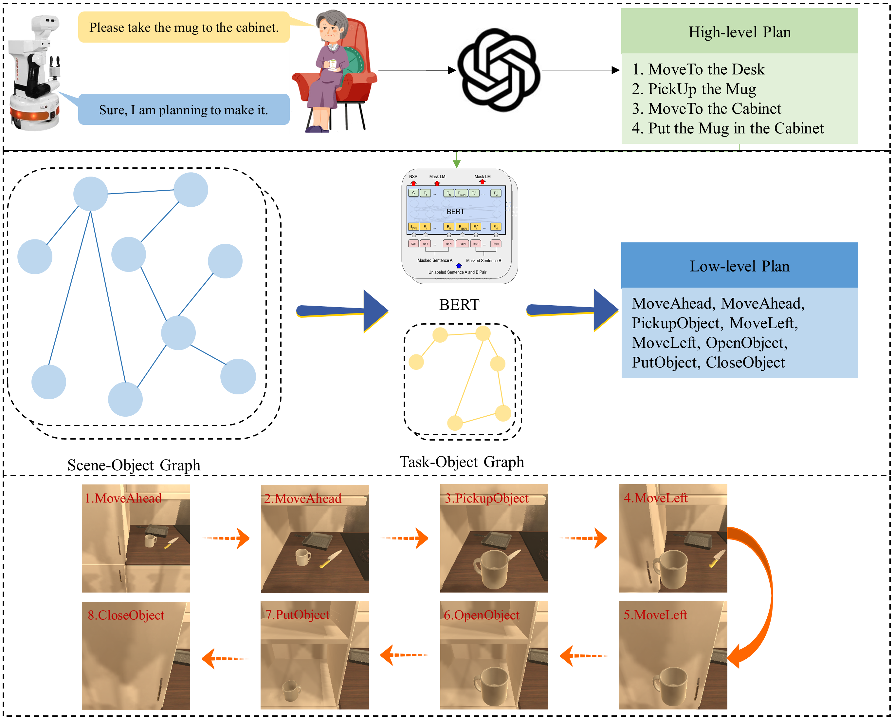
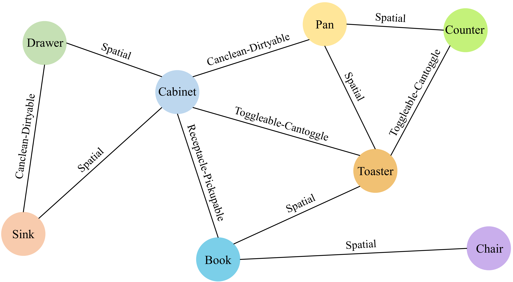
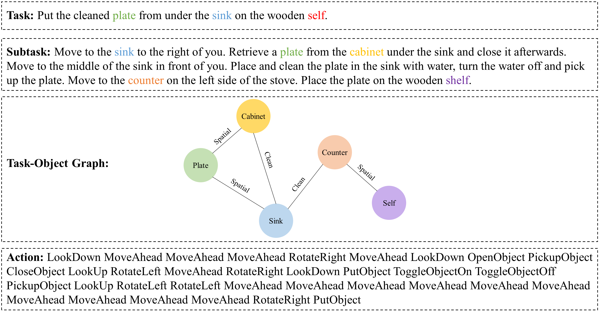

# Multi-Layer Graph-Embedding Task Planning: Integrating Scene and Task Object Graphs


**This repository serves as the official implementation of the paper "Multi-Layer Graph-Embedding Task Planning: Integrating Scene and Task Object Graphs". In this work, a multi-layer graph-embedding task planning framework is proposed, combining Large Language Models and graph neural networks. By constructing scene-object and task-object relationship graphs and utilizing Graph Attention Network (GAT) for node feature extraction, the integration of scene and task features is enhanced, improving task planning accuracy and efficiency.**




## 1. INSTALLATION

### 1. Clone the Repository

```
git clone https://github.com/Li-XD-Pro/MGTP.git
```

```
cd MGTP
```

### 2. Create a Conda Environment

Next, create a Conda environment with Python 3.8:

```
conda create --name MGTP python=3.8
```

Activate the environment:


```
conda activate MGTP
```

### 3. Install Dependencies


```
pip install -r requirements.txt
```


## 2.DATASET

In this paper, we constructed two datasets: one is the Scene Object Graph, and the other is the Task Object Graph.








## 3.USAGE

After completing the installation steps above, you can begin running the model training code.

You need to first run GAT_Embedding.py to generate item node embeddings for the scene graph. This will create a GAT_embedding_Dim768.json file. 


```
python GAT_Embedding.py
```


After that, run train.py to complete the full training process of MGTP.

```
python train.py
```


